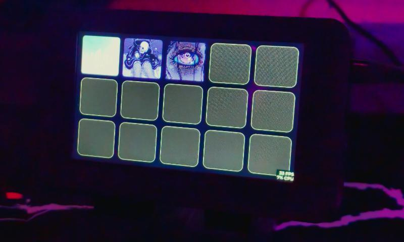

# LucydDeck

A low-cost DIY alternative to commercial stream decks powered by the ESP32-S3.

> [!IMPORTANT]
> **Work in Progress:** This project is currently in early development and is intended as a hobby project. Features, APIs, and documentation are subject to change as the v1.0.0 release approaches.



**Why, u may ask?**

Years ago, I wanted a macro pad like Elgato Stream Deck or Loupedeck but couldn't afford it. However, since I had discovered my fascination for microcontrollers such as the esp32 at the time, I came up with the idea of simply building one myself. This isn't the first prototype, but thanks to the Waveshare board, I can finally get around to realizing my idea and share it here for people who might also be interested in something like this.

## 🚀 Getting Started

To get your LucydDeck up and running, you will need the supported hardware and a local development environment to flash the firmware and run the desktop application. In the future you can flash the firmware directly through the app and only need it for development.

### Supported Hardware

- [Waveshare ESP32-S3-Touch-LCD-4.3](https://www.waveshare.com/wiki/ESP32-S3-Touch-LCD-4.3)

### Installation & Build

#### 1. Desktop App (Vue + Electron)

The app allows you to configure your deck and manage plugins.

1. **Clone the repository to your local machine:**

    ```bash
    git clone https://github.com/lucyd-dev/LucydDeck.git
    cd LucydDeck
    ```

2. **Install Dependencies:**

    ```bash
    npm install
    ```

3. **Run in Development:**

    ```bash
    npm run dev
    ```

4. **Build Executable:**

    ```bash
    # Build for all platforms
    npm run dist

    # Build for specific platform
    npm run dist:win
    npm run dist:linux
    ```

#### 2. Firmware (ESP32-S3)

See the [Firmware Repository](https://github.com/lucyd-dev/LucydDeck-firmware) for more information on how to build, upload and monitor the firmware/device.

## ✨Features (v1.0.0 Roadmap)

### Desktop App (Vue + Electron)

- **Intuitive UI:** Drag-and-drop style customization.
- **Page Management:** Organize buttons across multiple virtual pages.
- **Plugin overview:** Manage your plugins for more functionality
- **Device Management:** Integrated serial monitor, connection diagnostics, and "one-click" firmware flashing/updates.

### Firmware & Hardware

- **Core:** Built on the ESP32-S3 with PSRAM for smooth UI performance
- **Storage:** SD card support for storing icons, layouts, and configurations.
- **Connectivity:** High-speed USB communication (WiFi support planned).
- **Input:** Supports standard keyboard macros, media keys, mouse functions, and complex command sequences. Custom commands available with plugins.

## 📦Dependencies

LucydDeck is built upon these incredible open-source libraries and frameworks:

### Desktop App

- [Electron](https://www.electronjs.org/) - Cross-platform desktop framework.
- [Vue.js](https://vuejs.org/) - Progressive JavaScript framework for the UI.
- [Vite](https://vitejs.dev/) - Next-generation frontend tooling for fast builds.
- [crc](https://www.npmjs.com/package/crc) - For calculating cyclic redundancy checks during data transfer.

### Firmware

- [ESP32_Display_Panel](https://github.com/esp-arduino-libs/ESP32_Display_Panel) - Display driver implementation.
- [LVGL](https://github.com/lvgl/lvgl) - Light and Versatile Graphics Library.
- [ArduinoJson](https://github.com/bblanchon/ArduinoJson) - JSON serialization/deserialization.
- [CRC32](https://github.com/bakercp/CRC32) - Hardware-side Cyclic Redundancy Check.

## 🚀Future Ideas

- write plugins for basic apps like spotify, discord, obs etc.
- communication over WiFi
- custom PCB with tactical switches and rotary encoders
- rewrite for better performance, maybe in espressif/esp-idf

## 🔗 Quick Links

[Documentation](/docs/Readme.md)

[Desktop App Repository](https://github.com/lucyd-dev/LucydDeck)

[Firmware Repository](https://github.com/lucyd-dev/LucydDeck-firmware)

## 🤝 Contributing

If you find this project interesting or useful, contributions are highly welcome! Please feel free to leave a star ⭐ on the repo or submit a Pull Request.

## 📄 License

This project is licensed under the MIT License - see the [LICENSE.md](LICENSE.md) file for details.

**`Made with 💜 by Lucyd | 2026`**
